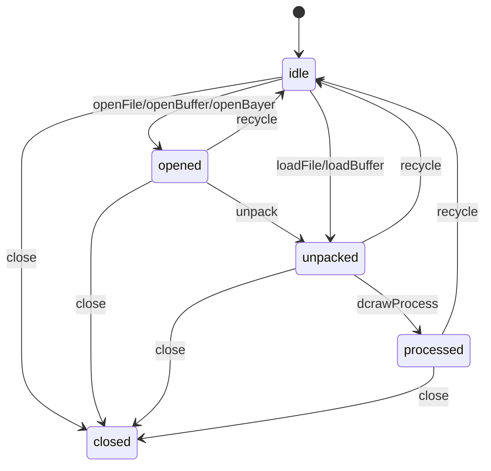

# Lifecycle, events, and cancellation

Each `LibRaw` instance owns a worker, a native processor, and a FIFO queue.
Operations on one instance never overlap; separate instances may decode in
parallel without blocking the calling event loop.



`recycle()` resets native state for reuse. `close()` waits for queued work,
releases the worker, is idempotent, and permanently closes the instance.

## Events

```js
processor.on("progress", ({ stage, iteration, expected }) => {});
processor.on("dataError", ({ offset, file }) => {});
processor.on("exifTag", ({ tag, type, length, order }) => {});
processor.on("makerNote", ({ tag, type, length, order }) => {});
```

Native callbacks are buffered inside the processor worker and emitted on the
owning instance immediately after the current native operation returns. The
`progress` event is therefore an ordered record of LibRaw processing stages,
not a live percentage suitable for driving an in-operation progress bar.

## Cancellation

```js
const controller = new AbortController();
const decoding = processor.loadFile("large.arw", {
  signal: controller.signal,
});
controller.abort();
await decoding;
```

Queued jobs reject without native execution. Active jobs share a cancellation
flag with the LibRaw progress callback. Rejections are always `LibRawError`
instances with `code`, `operation`, `librawCode`, `state`, and `cause`.

## Related

- [Getting started](getting-started.md) - File and buffer examples.
- [API mapping](api-mapping.md) - Callback mapping and exclusions.
